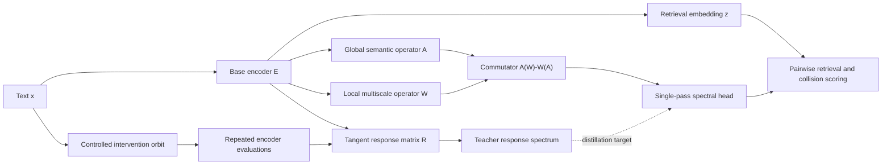

# Spectra v3: Semantic Response Spectra

## Status

This document is a research specification, not an implementation or a result. It proposes a new
direction for Spectra while preserving `spectra_v2` as a structural baseline. The proposal must pass
the Phase 0 measurement experiment before a new encoder architecture is justified.

The development-only v2 pilot has already falsified one strong version of the proposal: a universal
document-level response magnitude does not consistently identify task-critical changes. The current
direction is a **typed, query-conditioned response bundle** whose global, token-local, polarity, and
value fibers can be routed separately. See
[Phase 0 pilot v2 findings](PILOT_V2_FINDINGS.md).

## Research objective

Conventional text encoders map a text to a single point:

\[
E_\theta(x) = z_x \in \mathbb{R}^d.
\]

That point describes where the text lies in an embedding space, but not how stable its meaning is
around that point. Two texts may have high cosine similarity because they share topic and vocabulary
while differing in a decisive relation, such as negation, quantity, entity, time, modality, or scope.

Spectra v3 asks:

> Can a text representation include a compact spectrum of its response to controlled semantic
> interventions, and can that spectrum detect misleading similarities more reliably than a vector
> embedding alone?

The intended output is therefore not only an embedding, but an embedding with a local response
description:

\[
\operatorname{Spectra}(x) = \left(z_x, s_x, U_x, c_x\right),
\]

where:

- `z_x` is the retrieval embedding;
- `s_x` contains response-spectrum values;
- `U_x` is an optional low-rank response subspace or sketch;
- `c_x` is a learned single-input risk representation, not a calibrated probability by default.

For a pair `(q, d)`, the system may additionally estimate a **semantic collision score**: the risk
that high vector similarity hides a relation-level incompatibility.

## Why this is a departure from v2

Spectra v2 applies a Fourier transform over token position and compares it with a semantic-attention
path. V3 changes the object being analyzed:

- v2 studies the frequency content of a token sequence;
- v3 studies the frequency or singular spectrum of the encoder's response to semantic change.

Token position is not assumed to be a stationary physical time axis. The spectral object in v3 is a
local response operator defined by controlled interventions with explicit semantic roles.

The v2 dual mixer remains useful as a baseline. It is not assumed to be the final architecture.

## Nearest prior art and novelty risk

The components surrounding this proposal have substantial prior art:

- [FNet](https://aclanthology.org/2022.naacl-main.319/) replaces self-attention with Fourier token
  mixing in an encoder;
- [Global Filter Networks](https://papers.nips.cc/paper/2021/hash/07e87c2f4fc7f7c96116d8e2a92790f5-Abstract.html)
  and [AFNO](https://arxiv.org/abs/2111.13587) learn frequency-domain token mixers;
- [Matryoshka Representation Learning](https://papers.nips.cc/paper_files/paper/2022/hash/c32319f4868da7613d78af9993100e42-Abstract-Conference.html)
  establishes nested, adaptive embedding dimensions;
- [Maximum Classifier Discrepancy](https://arxiv.org/abs/1908.04951) and deep ensembles use
  predictive disagreement for OOD or uncertainty-related tasks;
- [RobustSentEmbed](https://aclanthology.org/2024.findings-naacl.241/) trains sentence embeddings
  against adversarial perturbations;
- [Adversarial Semantic Collisions](https://aclanthology.org/2020.emnlp-main.344/) demonstrates that
  misleading embedding similarity is a real retrieval vulnerability;
- [SemGrad](https://openreview.net/forum?id=q5TSIEE7WM) uses gradients with respect to
  semantics-preserving embeddings for uncertainty estimation.

The candidate contribution is therefore not Fourier mixing, perturbation training, Matryoshka
embeddings, or disagreement in isolation. The proposed research gap is their replacement by a
specific object and workflow:

1. a local response operator over semantically typed interventions;
2. its singular spectrum and response subspace as properties of a text representation;
3. pairwise semantic-collision detection from response-geometry compatibility;
4. distillation of that multi-evaluation teacher into a single-pass heterogeneous commutator;
5. adaptive retrieval controlled only after explicit calibration.

This combination appeared distinct in an initial literature scan, but that is not proof of novelty.
A systematic paper, code, and patent search is required before publication claims.

## Core definitions

### Intervention families

Let

\[
T_{a,t,\omega}(x)
\]

be an intervention of family `a`, strength `t`, and random realization `omega`.

Interventions are divided by their expected semantic effect, not merely by surface form.

#### Meaning-preserving interventions

Examples include:

- punctuation, casing, and whitespace changes;
- common spelling noise;
- syntax-preserving paraphrase;
- reversible formatting changes;
- controlled lexical substitutions verified to preserve the relevant relation.

The desired behavior is local invariance: the retrieval representation should move little and remain
task-equivalent.

#### Meaning-critical interventions

Examples include:

- negation insertion, deletion, or scope change;
- entity substitution;
- numerical value, unit, or comparator change;
- temporal shift;
- modality change such as `may`, `must`, and `did`;
- quantifier change such as `some`, `all`, and `none`;
- relation reversal or argument swap.

The desired behavior is not indiscriminate sensitivity. A critical intervention should cause a
representation change when it changes the task-relevant meaning. Each intervention therefore needs
a relation label or a verified counterfactual contract.

### Tangent response

For a normalized base embedding `z_x`, define the raw response:

\[
r_{a,t,\omega}(x) = E_\theta(T_{a,t,\omega}(x)) - E_\theta(x).
\]

To avoid measuring only the radial artifact introduced by normalization, project the response onto
the tangent plane of the unit sphere:

\[
\widetilde{r}_{a,t,\omega}(x)
= \left(I - z_x z_x^\top\right)r_{a,t,\omega}(x).
\]

Stacking responses produces a local response matrix:

\[
R_x =
\begin{bmatrix}
\widetilde{r}_1(x)^\top \\
\widetilde{r}_2(x)^\top \\
\cdots \\
\widetilde{r}_m(x)^\top
\end{bmatrix}.
\]

For an intervention confidence or design weight `w_i` in `[0, 1]`, the measured matrix uses
`sqrt(w_i) * r_i`. Response energy therefore scales linearly with `w_i`; the weight is not interpreted
as a calibrated semantic distance. Phase 0 initially sets `w_i` from the frozen intervention-strength
field and must report ablations with uniform weights.

### Response spectrum

Compute a truncated singular value decomposition:

\[
R_x \approx V_x \Sigma_x U_x^\top.
\]

The normalized diagonal of `Sigma_x` is the response spectrum `s_x`. Candidate summary statistics
include:

- total response energy;
- invariant-intervention energy;
- critical-intervention energy;
- effective response rank;
- spectral entropy;
- concentration in the top response modes;
- principal angles between invariant and critical response subspaces.

No statistic is called uncertainty or confidence until it is calibrated against observed errors.

### Semantic collision

A semantic collision is a pair `(q, d)` for which the base similarity is high while the texts are
incompatible under the relevant relation.

A collision model may use:

\[
\operatorname{collision}(q,d) =
g_\phi\left(
\cos(z_q,z_d),
s_q,
s_d,
\operatorname{angles}(U_q,U_d),
c_q,
c_d
\right).
\]

This score is pairwise. It must not be conflated with a universal single-text OOD score.

## Candidate single-pass mechanism: heterogeneous commutator

The full response matrix is expensive because it requires multiple transformed inputs. V3 proposes a
single-pass proxy based on two intentionally different operators:

- `A`: a global, content-dependent semantic operator;
- `W`: a local or multiscale structural operator designed to preserve transitions and logical cues.

Instead of comparing parallel branch outputs, measure their order dependence:

\[
C(x) = \operatorname{Pool}\left(A(W(h_x)) - W(A(h_x))\right).
\]

This is the **heterogeneous commutator representation**.

The commutator is not assumed a priori to equal uncertainty. Its role is empirical: determine
whether it can predict the teacher response spectrum and semantic-collision risk in one pass.

### Pilot-induced revision: from one spectrum to typed fibers

Matched synthetic controls showed that pooled response, token-local response, and polarity reasoning
solve different intervention families. A frozen NLI cross-encoder solved all four pilot families,
while late interaction solved entity, quantity, and time but not negation. Consequently, the
commutator should be evaluated as a student of multiple typed teachers rather than as a predictor of
one universal singular spectrum.

The working response object is now:

\[
\mathcal{R}(q,d) =
\{R_{global}, R_{local}, R_{polarity}, R_{value}\}_{q,d},
\]

with a calibrated router deciding which fibers are sufficient and which pairs require an expensive
cross-encoder. This is a hypothesis produced by the pilot, not a validated architecture.

The next multi-template pilot refined this again. A fixed norm over explicit lexical variables
transferred better than an unconstrained concatenation of all neural and NLI features. The preferred
object is therefore a set of independently canonicalized semantic coordinates with an explicit
reliability value per coordinate. See
[Phase 0 pilot v3 findings](PILOT_V3_VARIABLES_FINDINGS.md).

The first relation canonicalizer combines a lexical coordinate norm with the positive cosine drop
between the query and its selected document span. Its aggregation is fixed and monotone; an
unconstrained all-feature classifier remains an ablation because it overfit one held-out template.

### Why order dependence may matter

A local change such as negation can reorganize the global interpretation of a sentence. If local
structure is mixed before global interpretation, the result may differ from applying the global
semantic operator before the local structural operator. That difference contains a second-order
interaction that ordinary branch cosine disagreement discards.

### Structural operator candidates

The first comparison should include:

1. multiscale finite differences;
2. compact wavelet mixing;
3. local convolution with dilation;
4. the v2 learned Fourier filter;
5. a parameter-matched MLP control.

Wavelets and finite differences are preferred initial candidates because logical changes are local
and non-stationary. A Fourier operator remains a baseline rather than a protected design choice.

## Architecture stages



### Stage 0: frozen-encoder measurement

Use an existing strong text encoder without changing its weights. Generate controlled interventions,
measure `R_x`, and test whether response spectra predict known embedding failures.

This stage answers whether the proposed object contains useful signal before introducing a custom
architecture.

### Stage 1: response-spectrum distillation

Attach a compact head that predicts the teacher spectrum and optional response-subspace sketch from
a single clean input. The base encoder may remain frozen initially.

### Stage 2: commutator encoder

Introduce `A` and `W`, compute the heterogeneous commutator, and train it to predict the measured
response geometry. Only this stage justifies a new Spectra encoder.

### Stage 3: collision-aware retrieval

Train and calibrate the pairwise collision model. The base embedding still performs approximate
nearest-neighbour retrieval; collision scoring is applied to a shortlist unless a dot-product-
compatible formulation is demonstrated.

### Stage 4: adaptive computation

Only after collision prediction succeeds, test whether the response representation can control:

- Matryoshka embedding dimension;
- retrieval versus reranking;
- additional encoder depth;
- abstention or human review.

## Training objectives

The complete objective is modular:

\[
\mathcal{L} =
\mathcal{L}_{retrieval}
+ \lambda_{inv}\mathcal{L}_{invariance}
+ \lambda_{crit}\mathcal{L}_{critical}
+ \lambda_{spec}\mathcal{L}_{spectrum}
+ \lambda_{sub}\mathcal{L}_{subspace}
+ \lambda_{col}\mathcal{L}_{collision}.
\]

### Retrieval objective

Use a standard, reproduced contrastive retrieval objective. It is the quality anchor and must not be
silently weakened to improve diagnostic metrics.

### Invariance objective

For verified meaning-preserving interventions, minimize task-relevant movement. A robust loss should
be used so that incorrectly generated paraphrases do not dominate training.

### Critical-sensitivity objective

For verified meaning-changing counterfactuals, enforce a relation-aware margin. Do not push every
surface edit away; the label must specify whether the edit changes relevance, entailment, or another
target relation.

### Spectrum distillation

Predict log-scaled singular values or energy ratios with a robust regression loss. Absolute singular
vectors are sign-ambiguous, so subspace distillation should use projection matrices or principal-angle
losses rather than direct vector regression.

### Collision objective

Train on difficult pairs with high base similarity, including natural hard negatives and verified
counterfactuals. Random negatives alone are insufficient.

## Preventing shortcut solutions

The model could learn superficial edit detectors rather than semantic response geometry. Required
controls include:

- lexical controls with the same changed token but unchanged relation;
- paraphrases containing negation words without logical negation;
- entity and number changes that are relevant in some contexts and irrelevant in others;
- symmetric templates that balance surface cues across labels;
- held-out intervention generators;
- human-verified evaluation subsets;
- cross-domain testing where edit vocabulary differs from training.

The intervention generator and the evaluator must not share templates in the final test.

## Baselines

Every diagnostic claim must compare against:

- embedding norm;
- distance from the training centroid;
- nearest-neighbour distance;
- Mahalanobis distance in embedding space;
- scalar perturbation variance;
- gradient norm or a semantic-gradient baseline;
- Monte Carlo dropout where applicable;
- a small supervised confidence head;
- v2 parallel-branch cosine disagreement;
- cross-encoder score or margin on the reranking shortlist.

The response spectrum is useful only if it adds information beyond these simpler signals.

## Phase 0 experiment

The concrete first-run design is specified in
[Phase 0: Semantic Response Measurement](PHASE0_RESPONSE_MEASUREMENT.md).

### Primary question

Does the local response spectrum predict semantic collisions and retrieval failures better than
scalar sensitivity and distance-based baselines?

### Data slices

Use separate evaluation slices for:

1. natural retrieval hard negatives;
2. negation and scope minimal pairs;
3. entity, number, unit, and date counterfactuals;
4. paraphrase and surface-noise invariance;
5. domain shift;
6. adversarial semantic collisions.

Results must be reported per slice. A single pooled score can hide incompatible behavior.

### Metrics

- retrieval Recall@K, nDCG@10, and MRR;
- collision AUROC and AUPRC;
- risk-coverage curve and area under the risk-coverage curve;
- calibration error after an explicit calibration step;
- false-positive rate at fixed collision recall;
- added latency, memory, and encoder calls;
- bootstrap confidence intervals and per-seed raw results.

### Pre-registered continuation gate

Proceed from Stage 0 to Stage 1 only if all of the following hold:

1. response-spectrum features beat the best cheap baseline on at least two distinct failure families;
2. the gain is present across seeds or bootstrap intervals, not only in a pooled point estimate;
3. the signal survives a held-out intervention generator;
4. the result is not explained by text length, token count, edit distance, or base cosine similarity;
5. at least one response statistic adds value in a multivariate model that already includes the base
   embedding diagnostics.

No architectural novelty is claimed if the measurement object itself fails this gate.

## Initial hypotheses

### H1: response rank

Texts with ambiguous or brittle semantics have a higher effective response rank than stable texts,
after controlling for length and edit distance.

### H2: invariant/critical separation

Reliable embeddings exhibit low energy under meaning-preserving interventions and structured,
relation-specific energy under meaning-changing interventions.

### H3: collision geometry

False high-similarity pairs have more incompatible response subspaces than true relevant pairs with
the same base-similarity distribution.

### H4: commutator distillation

A single-pass heterogeneous commutator predicts useful response-spectrum statistics more accurately
than a parameter-matched pooled MLP or parallel-branch disagreement head.

### H5: adaptive value

Conditioning reranking or representation size on calibrated collision risk reduces average compute at
fixed retrieval quality.

## Repository plan

Do not replace `spectra_v2` immediately. If Phase 0 succeeds, add a separate `spectra_v3` package:

```text
spectra_v3/
    config.py
    interventions.py
    response.py
    spectra.py
    commutator.py
    model.py
    collision.py
    calibration.py

experiments/
    phase0_measure_response.py
    phase1_distill_spectrum.py
    phase2_train_commutator.py

tests/
    test_intervention_contracts.py
    test_tangent_response.py
    test_spectrum_invariances.py
    test_commutator_ablation.py
    test_collision_contract.py
```

Phase 0 should initially be implemented as a measurement harness independent of `spectra_v2`. This
keeps the scientific question separable from the current architecture.

## Claim boundaries

Before experimental validation, use:

- `response-spectrum feature`, not `uncertainty`;
- `collision score`, not `truth score`;
- `meaning-critical intervention`, not automatically `semantic change`;
- `single-pass proxy`, not `calibrated confidence`;
- `candidate mechanism`, not `novel architecture`.

Novelty requires a dedicated literature and patent review. Utility requires matched experiments.
Neither follows from the mathematical formulation alone.

## Immediate next decisions

The first implementation must resolve:

1. which frozen encoder supplies the base embedding;
2. which two task domains define relevance;
3. the first six intervention families and their validation rules;
4. whether Phase 0 stores full response vectors or only randomized low-rank sketches;
5. the first natural and synthetic collision datasets;
6. the exact confounder controls and continuation thresholds.

These decisions define the measurement experiment. Choosing the final mixer architecture before
answering them would repeat the central mistake of the legacy prototype: building claims into the
model before establishing the phenomenon.
